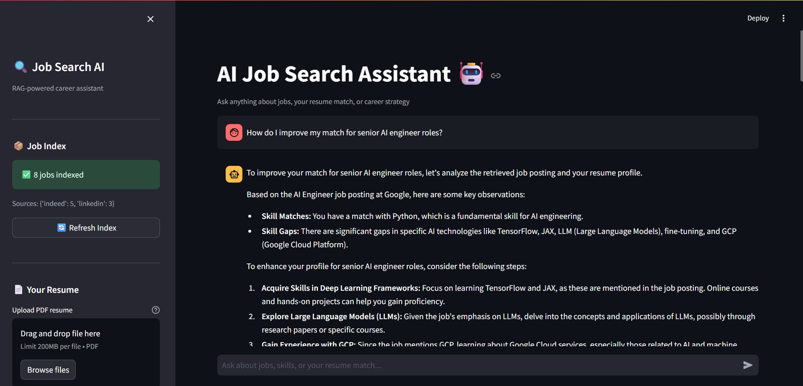
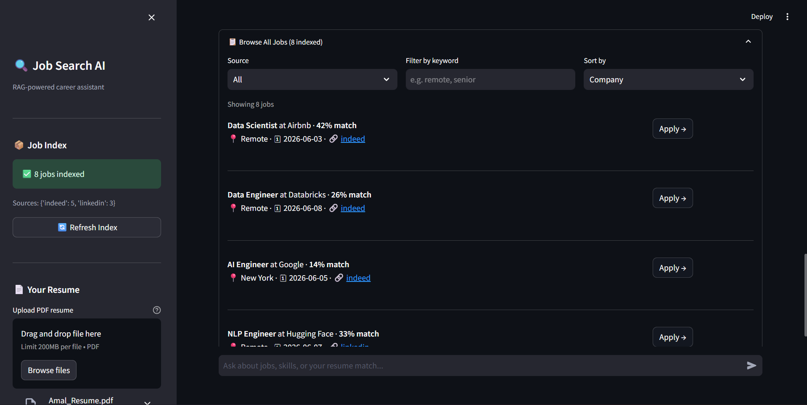

# 🚀 AI Job Search Assistant


> **Live Demo:** [https://jobsearchaibot.streamlit.app/](https://jobsearchaibot.streamlit.app/)  
> Try it now — recruiters can search jobs in real time!

---

## 📌 Overview
The **AI Job Search Assistant** is a smart pipeline that scrapes job postings from **Indeed** and **LinkedIn**, embeds them using **Sentence Transformers**, and indexes them with **FAISS** for lightning‑fast semantic search.  

This project is designed as a **portfolio piece** to showcase:
- End‑to‑end AI pipelines (scraping → embedding → search).
- Practical use of **transformer models** in job search automation.
- Deployable, recruiter‑friendly apps with **Streamlit UI**.

---

## ⚙️ Setup Instructions

```bash
# 1. Create virtual environment
python -m venv venv
source venv/bin/activate        # Windows: venv\Scripts\activate

# 2. Install dependencies
pip install -r requirements.txt

# 3. Configure API keys
cp .env.example .env
# Edit .env → add ANTHROPIC_API_KEY=sk-ant-...

---


## 📸 Screenshots

### Home Page



### Semantic Search Results


---

🤝 Contributing
Pull requests are welcome. For major changes, please open an issue first to discuss what you’d like to change.

📄 License
MIT License — free to use, modify, and share.
